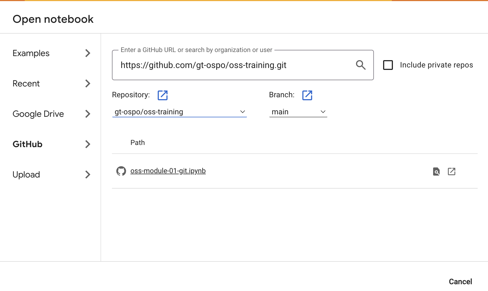
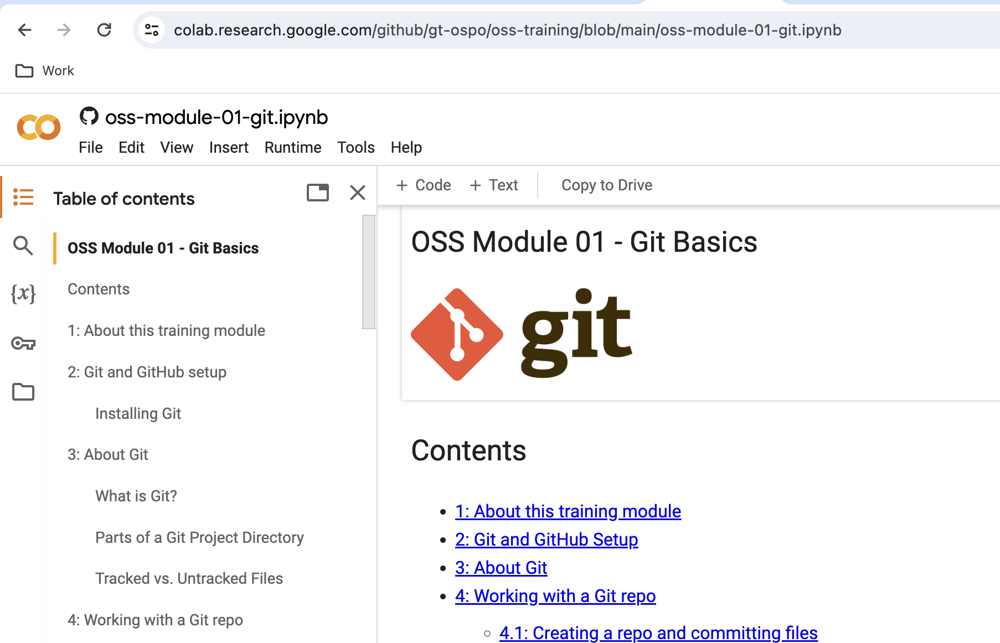

<div align="center">

[](https://creativecommons.org/licenses/by-sa/4.0/)
[](https://github.com/gt-ospo/oss-training/stargazers)
[](https://github.com/gt-ospo/oss-training/network/members)
[](https://github.com/gt-ospo/oss-training/issues)
[](https://github.com/gt-ospo/oss-training/graphs/contributors)

# OSS Training from GT OSPO


</div>

This repository contains comprehensive training modules for getting started with open source software development. The training modules are provided as interactive Jupyter Notebooks that you can read like a book or run interactively in a Jupyter session.

## 📚 Training Modules

| Module | Title | Description | Links |
|--------|-------|-------------|-------|
| **00** | **Interacting with Git and GitHub** | Introduction to Git concepts, branching, and merging fundamentals | [📖 View](notebook-lessons/oss-module-00-interacting-with-git.ipynb) · [🔗 NBViewer](https://nbviewer.org/github/gt-ospo/oss-training/blob/main/notebook-lessons/oss-module-00-interacting-with-git.ipynb) · [🚀 Colab](https://colab.research.google.com/github/gt-ospo/oss-training/blob/main/notebook-lessons/oss-module-00-interacting-with-git.ipynb) |
| **01** | **Git Basics** | Fundamental Git operations, repositories, and version control workflows | [📖 View](notebook-lessons/oss-module-01-git.ipynb) · [🔗 NBViewer](https://nbviewer.org/github/gt-ospo/oss-training/blob/main/notebook-lessons/oss-module-01-git.ipynb) · [🚀 Colab](https://colab.research.google.com/github/gt-ospo/oss-training/blob/main/notebook-lessons/oss-module-01-git.ipynb) |
| **02** | **Git Workflows: Issues, Forks, and Pull Requests** | Collaborative workflows on GitHub including issues, forks, and pull requests | [📖 View](notebook-lessons/oss-module-02-forks.ipynb) · [🔗 NBViewer](https://nbviewer.org/github/gt-ospo/oss-training/blob/main/notebook-lessons/oss-module-02-forks.ipynb) · [🚀 Colab](https://colab.research.google.com/github/gt-ospo/oss-training/blob/main/notebook-lessons/oss-module-02-forks.ipynb) |
| **03** | **Testing Code: What, Why and How To** | Comprehensive guide to software testing including unit, integration, and acceptance testing | [📖 View](notebook-lessons/oss-module-03-testing-code.ipynb) · [🔗 NBViewer](https://nbviewer.org/github/gt-ospo/oss-training/blob/main/notebook-lessons/oss-module-03-testing-code.ipynb) · [🚀 Colab](https://colab.research.google.com/github/gt-ospo/oss-training/blob/main/notebook-lessons/oss-module-03-testing-code.ipynb) |
| **04** | **Continuous Integration and Continuous Delivery** | CI/CD concepts, GitHub Actions, and automated testing workflows | [📖 View](notebook-lessons/oss-module-04-ci-cd.ipynb) · [🔗 NBViewer](https://nbviewer.org/github/gt-ospo/oss-training/blob/main/notebook-lessons/oss-module-04-ci-cd.ipynb) · [🚀 Colab](https://colab.research.google.com/github/gt-ospo/oss-training/blob/main/notebook-lessons/oss-module-04-ci-cd.ipynb) |
| **05** | **Code Review** | Best practices for conducting effective code reviews and maintaining code quality | [📖 View](notebook-lessons/oss-module-05-code-review.ipynb) · [🔗 NBViewer](https://nbviewer.org/github/gt-ospo/oss-training/blob/main/notebook-lessons/oss-module-05-code-review.ipynb) · [🚀 Colab](https://colab.research.google.com/github/gt-ospo/oss-training/blob/main/notebook-lessons/oss-module-05-code-review.ipynb) |
| **06** | **Governance Foundations** | Open source governance models, foundations, and decision-making processes | [📖 View](notebook-lessons/oss-module-06-governance-foundations.md) · [🔗 NBViewer](https://nbviewer.org/github/gt-ospo/oss-training/blob/main/notebook-lessons/oss-module-06-governance-foundations.md) |
| **07** | **OSS Project Best Practices** | Tips for successful open source projects and lessons from established projects | [📖 View](notebook-lessons/oss-module-07-oss-project-best-practices.md) · [🔗 NBViewer](https://nbviewer.org/github/gt-ospo/oss-training/blob/main/notebook-lessons/oss-module-07-oss-project-best-practices.md) |
| **08** | **Open Source Lifecycle and Sustainability** | Understanding OSS project lifecycle, sustainability evaluation, and ecosystem dynamics | [📖 View](notebook-lessons/oss-module-08-foss-code-life.ipynb) · [🔗 NBViewer](https://nbviewer.org/github/gt-ospo/oss-training/blob/main/notebook-lessons/oss-module-08-foss-code-life.ipynb) · [🚀 Colab](https://colab.research.google.com/github/gt-ospo/oss-training/blob/main/notebook-lessons/oss-module-08-foss-code-life.ipynb) |

## 🚀 Getting Started

### 💻 Running Locally

All training notebooks require the `jupyter` Python package. Some may require additional packages (such as `bash_kernel`). See the intro section of each notebook for details.

```bash
pip install jupyter jupyterlab bash_kernel
python -m bash_kernel.install
```

### 🌐 Running with Google Colab

The notebooks can also be loaded using [Google Colab](https://colab.research.google.com/), a hosted Jupyter notebook service from Google. To run these notebooks using Colab:

1. Go to [colab.research.google.com](https://colab.research.google.com/) (you may need to log in with your Google account)
2. Click on `File → Open Notebook`
3. Go to the `GitHub` tab and paste the repo URL: `https://github.com/gt-ospo/oss-training.git`
4. Click the search icon and select the notebook you wish to run
5. Use the `Runtime` tab to execute the notebook

<div align="center">
  
  <br><br>
  
</div>

## 🤝 Contributing

We welcome contributions to improve these training materials! Please read our [Contributing Guidelines](CONTRIBUTING.md) for details on how to submit improvements, report issues, or suggest new content.

## 📄 License

This project is licensed under the [Creative Commons Attribution-ShareAlike 4.0 International License](https://creativecommons.org/licenses/by-sa/4.0/). See the [LICENSE](LICENSE) file for details.

## 🏛️ About GT OSPO

The Georgia Tech Open Source Program Office (GT OSPO) promotes and supports open source software development, education, and research within the Georgia Tech community and beyond.

---

<div align="center">
  <strong>Happy Learning! 🎓</strong>
  <br>
  <em>If you find these materials helpful, please consider giving us a ⭐!</em>
</div>
